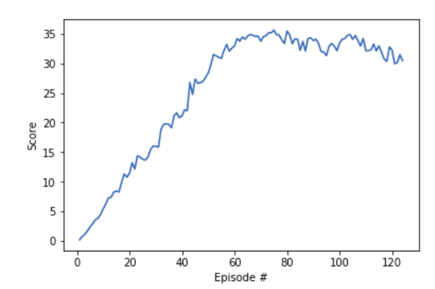

# Project Continuous control

## Overview

This project aims to train an o train a double-jointed arm to move to target location.
A reward of +0.1 is provided for each step that the agent's hand is in the goal location. Thus, the goal of your agent is to maintain its position at the target location for as many time steps as possible.

The observation space consists of 33 variables corresponding to position, rotation, velocity, and angular velocities of the arm. Each action is a vector with four numbers, corresponding to torque applicable to two joints. Every entry in the action vector should be a number between -1 and 1.

## Environment 

The environment for this purpose is the reacher environment on the Unity ML-Agents GitHub page. The task given here is episodic. 
There are 2 different environments available
The first version contains a single agent.  
The second version contains 20 identical agents, each with its own copy of the environment.    
In this project we use the second environment.   
The agent is considered to be trained when it achieves average reward of +30 over 100 consequtive episodes. As the environment uses 20 agents. The average reward is calculated as follows.  
After each episode, we add up the rewards that each agent received (without discounting), to get a score for each agent.  This yields 20 (potentially different) scores.  We then take the average of these 20 scores. 
This yields score for each episode (where the average is over all 20 agents).

## Implementation Details

The problem is solved using the Deep Deterministic Policy Gradient (ddpg) algorithm with a replay buffer. The algorithm used was obtained from the paper Continuous control with deep reinforcement learning by Timothy P. Lillicrap et al. Here all the agents share the same actor and critic networks with a common replay buffer. 

### Network Architecture

The network used for training comprised of 3 layers. The input for the network comprised of 33 different states.
Three fully connected hidden layers were used for both critic and actor. The actor network is as follows  
Input - 33 states  
Layer1 - 256 neurons   
Layer2 - 128 neurons    
Output - 4 actions  
For all the hidden layers Relu activation functions were used. The output uses a tanh function as it produces value between 1 and -1.  
While the critic network also comprises of 3 layers.  
The actor network is as follows  
Input - 33 states and action  
Layer1 - 256 neurons    
Layer2 - 128 neurons    
Output - 1
The leaky relu is used to speed up training for first two layers and a linear function is used for the output layer.

### Hyperparameters

The most important hperpaparamters and their respective values used while training the network are given as follows:  

Replay buffer size = 1000000  
Batch size = 128  
Discount factor(gamma) = 0.99  
Tau = 0.001 (soft update parameter)  
Learning rate actor = 0.0001  
Learning rate critic = 0.0001 

All the agents were updated 10 times every 20 time steps

## Result

The agent achieved the expected accuracy of +30 after 124 episodes of training.
The score obtained by the agent in each episode is shown below

## Future work

The environment was solved with a ddpg algorithm with a good overall accuracy with a very few linear layers. It would be interesting to try out algorithms like PPO, A3C, and D4PG which are effective when parallized also one improvement to the current algorithm is to  use priotirized experience replay. As the current environment took a lot of time to train even in a GPU.
